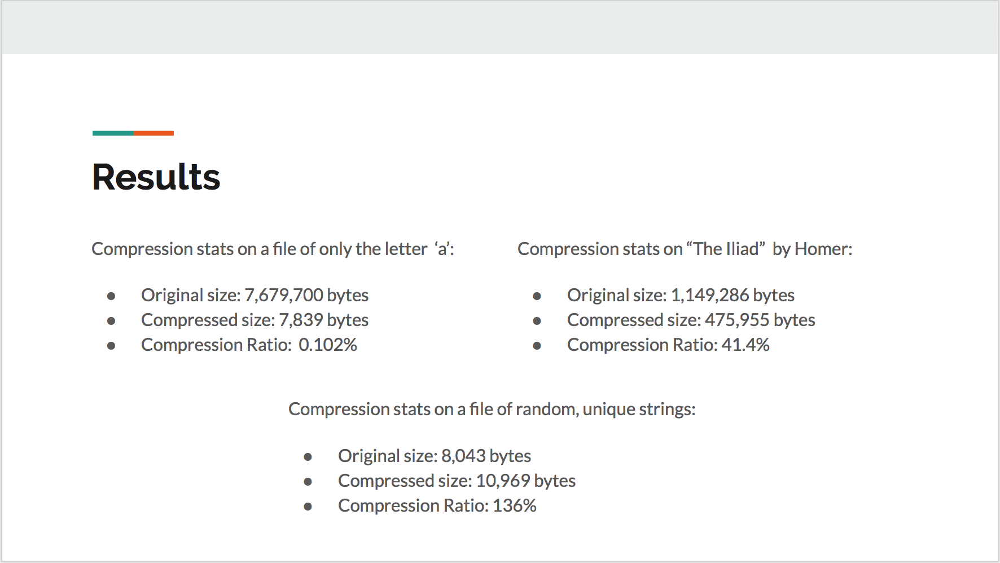

# HsCompress
A lossless compression library and command line tool, written in Haskell. This library makes use of the LZW algorithm to compress and decompress files.

## Usage
The Compress.hs and Decompress.hs files may be imported to any project to compress arbitrary strings and decompress arbitrary bytestrings respectively. The Compressor.hs file serves as a tool to compress and decompress files in the .hsc compression format, and can be used from the command line.

## Compilation
To use the command line tool for compression:
```shell
ghc -o compressor Compressor.hs
```
## Results

